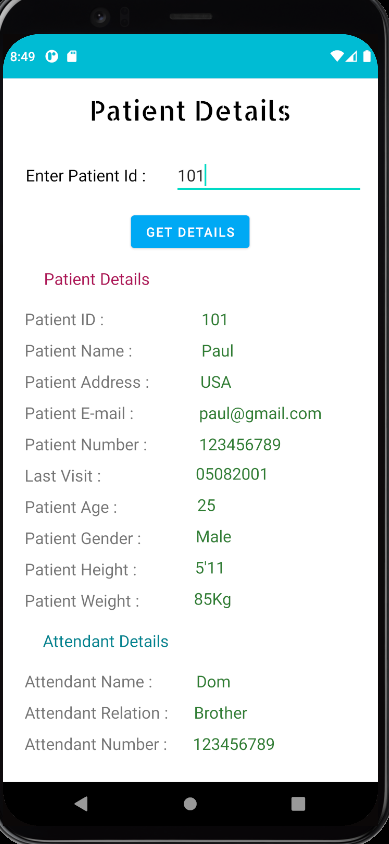
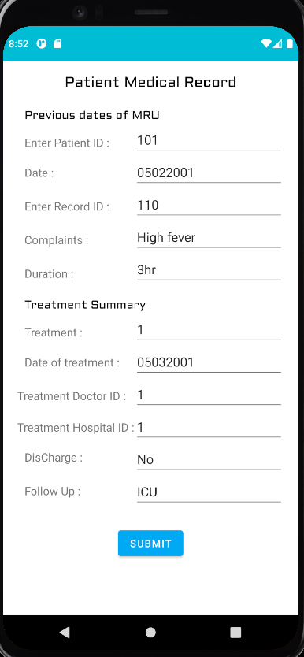

<h1>Healthcare ⚕️</h1>

## Objective :

Obtaining a user's entire medical history across multiple health providers is a challenge. We want to present an easier way to store a user's entire medical history.
Suppose If u met with an accident and are taken to a Hospital  the doctor asks us about all alergies to medicine.At that particular time we are not in full consciousness, So its not convinient for us to tell all of that. So having all the details on a platform which can be accesses by the doctor when needed Will make it easy for doctor to treat us in emergency.
Also sometimes hospitals dont share the patient history with other hospitals, which can cause probles as the hospital has to make all the entries again so that can also be solved using this app.

## Note :
We were working on creating a decentralized application for the same, As that application was taking more than 2days to build completely, we are keeping it as a sidework for us till then we are hosting the data on phyMyAdmin. For making the app decentralized we would be using smartcontracts written in Solidity  for the data and ipfs to store the data and etherium for storing the hashes. You can find that project on

## Technology Stack :

- Android Studio

- PhpStorm

- phpMyAdmin

- Xampp

## Team Members :
- [Alan Alex](https://github.com/alan2000alex)

- [Ishan Gupta](https://github.com/ishan-gupt)

- [Ritesh Puvvada](https://github.com/RiteshPuvvada)

## Screenshots :

   

   

   

